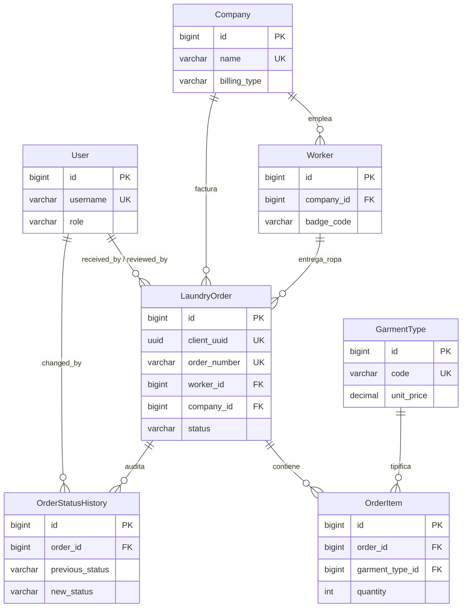

# Diccionario de Base de Datos — Servilion Backend

> **Propósito:** Documento de referencia para IAs y desarrolladores. Describe **todas** las tablas, campos, relaciones, enums, reglas de negocio y endpoints de la API asociados al modelo de datos PostgreSQL de Servilion.
>
> **Complementa:** `AI_CONTEXT.md` (reglas de arquitectura), `FLUJO_NEGOCIO.md` (dominio y flujo operativo).
>
> **Última revisión del esquema:** migraciones iniciales `0001_initial` (2026-07-20). Si se agregan migraciones, **actualizar este archivo**.

---

## 1. Resumen ejecutivo

| Concepto | Valor |
|---|---|
| Motor | PostgreSQL |
| ORM | Django 5.x |
| Usuario auth custom | `authentication.User` (`AUTH_USER_MODEL`) |
| Apps con modelos | `common` (abstracta), `authentication`, `companies`, `workers`, `garments`, `orders` |
| Tablas de negocio | 7 (+ tablas Django auth estándar) |
| Prefijo API | `/api/` |
| Sincronización móvil | Offline-first vía `client_uuid` + `updated_at` |
| Archivos | Solo claves S3 en DB (`logo_key`, `photo_key`); el binario vive en AWS S3 |

### Distinción crítica de actores

| Actor | Modelo | ¿Es usuario del sistema? |
|---|---|---|
| Staff de Servilion (recepción, lavandería, despacho…) | `authentication.User` | **Sí** — JWT, panel web, app móvil |
| Trabajador de empresa contratista (entrega/recibe ropa) | `workers.Worker` | **No** — solo aparece en guías |
| Empresa contratista/mandante | `companies.Company` | **No** — entidad de facturación |

---

## 2. Diagrama entidad-relación



---

## 3. Modelo base abstracto

### `TimeStampedModel` (no es tabla)

App: `common` — clase abstracta heredada por la mayoría de entidades.

| Campo | Tipo Django | Tipo PostgreSQL | Null | Descripción |
|---|---|---|---|---|
| `created_at` | `DateTimeField(auto_now_add=True)` | `timestamptz` | NO | Fecha/hora de creación del registro |
| `updated_at` | `DateTimeField(auto_now=True, db_index=True)` | `timestamptz` | NO | Última modificación. **Índice.** Usado por sync móvil (last-write-wins) |

---

## 4. Tablas

Convención de nombres Django → PostgreSQL: `{app_label}_{modelname_lowercase}`.

---

### 4.1 `authentication_user`

**Modelo Django:** `authentication.User`  
**Descripción:** Personal de Servilion que opera el sistema (panel web + app móvil). Extiende `AbstractUser` de Django.

| Campo | Tipo | Max | Null | Default | UK/Idx | Descripción |
|---|---|---|---|---|---|---|
| `id` | BigAutoField | — | NO | auto | PK | Identificador interno |
| `password` | CharField | 128 | NO | — | — | Hash de contraseña (Django) |
| `last_login` | DateTimeField | — | SÍ | NULL | — | Último login |
| `is_superuser` | BooleanField | — | NO | false | — | Acceso total Django Admin |
| `username` | CharField | 150 | NO | — | **UK** | Login único |
| `first_name` | CharField | 150 | NO | '' | — | Nombre |
| `last_name` | CharField | 150 | NO | '' | — | Apellido |
| `email` | EmailField | 254 | NO | '' | — | Correo |
| `is_staff` | BooleanField | — | NO | false | — | Puede entrar al Django Admin |
| `is_active` | BooleanField | — | NO | true | — | Cuenta activa |
| `date_joined` | DateTimeField | — | NO | now | — | Alta en el sistema |
| `role` | CharField | 20 | NO | `DIGITADOR_OT` | — | Rol operativo (ver enum §5.1) |
| `phone` | CharField | 20 | NO | '' | — | Teléfono de contacto |

**Relaciones M2M (tablas puente Django):**
- `authentication_user_groups` → `auth_group`
- `authentication_user_user_permissions` → `auth_permission`

**Notas:**
- No confundir con `workers.Worker`.
- El JWT incluye `user_id` en el payload; la API expone rol vía `GET /api/auth/me`.

---

### 4.2 `companies_company`

**Modelo Django:** `companies.Company`  
**Descripción:** Empresa contratista/mandante cuyos trabajadores usan el servicio de lavandería. Cliente de facturación.

| Campo | Tipo | Max | Null | Default | UK/Idx | Descripción |
|---|---|---|---|---|---|---|
| `id` | BigAutoField | — | NO | auto | PK | |
| `created_at` | DateTimeField | — | NO | auto | — | Heredado de TimeStampedModel |
| `updated_at` | DateTimeField | — | NO | auto | **Idx** | |
| `name` | CharField | 100 | NO | — | **UK** | Nombre comercial (ej. SODEXO PEÑÓN) |
| `tax_id` | CharField | 15 | NO | '' | — | RUT empresa |
| `billing_type` | CharField | 10 | NO | `PRENDAS` | — | Modalidad de cobro (enum §5.2) |
| `contact_name` | CharField | 100 | NO | '' | — | Persona de contacto |
| `phone` | CharField | 20 | NO | '' | — | Teléfono |
| `logo_key` | CharField | 255 | NO | '' | — | Clave del objeto en S3 (`empresas/logos/{uuid}.ext`) |
| `is_active` | BooleanField | — | NO | true | — | Soft-delete lógico |

**Orden por defecto:** `name` ASC  
**On delete (como FK):** `PROTECT` — no se puede borrar si tiene workers u orders

**Campo derivado en API (no en DB):** `logo_url` — URL pública construida desde `logo_key`

---

### 4.3 `workers_worker`

**Modelo Django:** `workers.Worker`  
**Descripción:** Trabajador de una empresa contratista. Entrega y recibe ropa. **No es usuario del sistema.**

| Campo | Tipo | Max | Null | Default | UK/Idx | Descripción |
|---|---|---|---|---|---|---|
| `id` | BigAutoField | — | NO | auto | PK | |
| `created_at` | DateTimeField | — | NO | auto | — | |
| `updated_at` | DateTimeField | — | NO | auto | **Idx** | |
| `company_id` | ForeignKey → `companies_company` | — | NO | — | FK, **Idx compuesto** | Empresa a la que pertenece |
| `badge_code` | CharField | 20 | NO | — | **UK compuesto** | Código/credencial de faena |
| `full_name` | CharField | 100 | NO | — | — | Nombre completo |
| `national_id` | CharField | 15 | NO | '' | **Idx** | RUT |
| `current_room_id` | ForeignKey → `camps_room` | — | SÍ | NULL | FK | Pieza donde vive HOY. `SET_NULL`. Reemplaza a los antiguos `camp`/`room` de texto libre (migración `workers.0002`) |
| `shift` | CharField | 10 | NO | '' | — | Turno de rotación (10x10, 7x7, 4x4…) |
| `position` | CharField | 50 | NO | '' | — | Cargo |
| `area` | CharField | 50 | NO | '' | — | Área/sector |
| `phone` | CharField | 20 | NO | '' | — | Teléfono |
| `is_active` | BooleanField | — | NO | true | **Idx compuesto** | Soft-delete lógico |

**Constraints:**
- `unique_badge_code_per_company` → UNIQUE (`company_id`, `badge_code`)

**Índices:**
- `workers_wor_company_07e779_idx` → (`company_id`, `is_active`)

**Orden por defecto:** `full_name` ASC  
**On delete:** `PROTECT` (desde LaundryOrder)

**Clave natural (import legado):** par (`company`, `badge_code`)

---

### 4.3b `camps_camp`

**Modelo Django:** `camps.Camp`
**Descripción:** Campamento/patio de la faena donde se aloja el personal. Cuelga de `Client` y no de `Company`: varias contratistas del mismo cliente alojan gente en el mismo campamento.

| Campo | Tipo | Max | Null | Default | UK/Idx | Descripción |
|---|---|---|---|---|---|---|
| `id` | BigAutoField | — | NO | auto | PK | |
| `client_id` | ForeignKey → `companies_client` | — | NO | — | FK, **UK compuesto** | `CASCADE` |
| `name` | CharField | 100 | NO | — | **UK compuesto** | Nombre del campamento |
| `is_active` | BooleanField | — | NO | true | **Idx compuesto** | Soft-delete lógico |

**Constraints:** `unique_camp_per_client` → UNIQUE (`client_id`, `name`)

---

### 4.3c `camps_room`

**Modelo Django:** `camps.Room`
**Descripción:** Pieza de un campamento. Es el destino físico de la entrega y el objeto que la app móvil identifica al escanear el QR de la puerta.

| Campo | Tipo | Max | Null | Default | UK/Idx | Descripción |
|---|---|---|---|---|---|---|
| `id` | BigAutoField | — | NO | auto | PK | |
| `camp_id` | ForeignKey → `camps_camp` | — | NO | — | FK, **UK compuesto** | `CASCADE` |
| `number` | CharField | 20 | NO | — | **UK compuesto** | Número de pieza |
| `qr_code` | UUIDField | — | NO | `uuid4` | **UK** | Código pegado en la puerta. No editable: ya está impreso |
| `is_active` | BooleanField | — | NO | true | **Idx compuesto** | Soft-delete lógico |

**Constraints:** `unique_room_per_camp` → UNIQUE (`camp_id`, `number`)

**Por qué el QR es UUID y no el número de pieza:** el número se repite entre campamentos y puede reasignarse; el UUID identifica la puerta de forma única y estable.

---

### 4.4 `garments_garmenttype`

**Modelo Django:** `garments.GarmentType`  
**Descripción:** Catálogo de tipos de prenda procesados (ej. PANTALON SLACK, TOALLA, CHALECO GEÓLOGO).

| Campo | Tipo | Max | Null | Default | UK/Idx | Descripción |
|---|---|---|---|---|---|---|
| `id` | BigAutoField | — | NO | auto | PK | |
| `created_at` | DateTimeField | — | NO | auto | — | |
| `updated_at` | DateTimeField | — | NO | auto | **Idx** | |
| `code` | CharField | 10 | NO | — | **UK** | Código corto único |
| `name` | CharField | 60 | NO | — | — | Nombre descriptivo |
| `unit_price` | DecimalField | 10,2 | NO | 0 | — | Precio unitario vigente en catálogo |
| `is_active` | BooleanField | — | NO | true | — | Visible en operación |

**Orden por defecto:** `name` ASC

**Regla de negocio:** Al crear un `OrderItem`, se **congela** `unit_price` desde el catálogo en el momento de la guía. Cambios futuros de tarifa no alteran guías ya creadas.

---

### 4.5 `orders_laundryorder`

**Modelo Django:** `orders.LaundryOrder`  
**Nombre de negocio:** **Guía** (legacy: `ot`)  
**Descripción:** Unidad de trabajo desde recepción de ropa sucia hasta entrega/cobro.

| Campo | Tipo | Max | Null | Default | UK/Idx | Descripción |
|---|---|---|---|---|---|---|
| `id` | BigAutoField | — | NO | auto | PK | ID servidor |
| `created_at` | DateTimeField | — | NO | auto | — | |
| `updated_at` | DateTimeField | — | NO | auto | **Idx** | Resolución de conflictos sync |
| `client_uuid` | UUIDField | — | NO | uuid4 | **UK** | Idempotencia offline-first (generado en dispositivo) |
| `order_number` | CharField | 20 | NO | — | **UK** | N° OT / número de guía |
| `ticket_number` | CharField | 20 | NO | '' | — | N° ticket/boleta auxiliar |
| `worker_id` | ForeignKey → `workers_worker` | — | NO | — | FK | Trabajador que entrega la ropa |
| `company_id` | ForeignKey → `companies_company` | — | NO | — | FK, **Idx compuesto** | Empresa (denormalizada desde worker; facturación) |
| `delivery_room_id` | ForeignKey → `camps_room` | — | SÍ | NULL | FK | Destino de ESTA entrega, congelado al digitalizar desde `worker.current_room`. `SET_NULL`. Si el trabajador se muda mientras la ropa está en planta, el morral igual va donde correspondía |
| `shift` | CharField | 10 | NO | '' | — | Turno al momento de la guía |
| `status` | CharField | 15 | NO | `RECIBIDA` | **Idx**, **Idx compuesto** | Estado del flujo (enum §5.3) |
| `garment_count` | PositiveIntegerField | — | NO | 0 | — | Total de prendas (suma de items) |
| `weight_kg` | DecimalField | 6,2 | SÍ | NULL | — | Peso del lote completo en kg |
| `received_at` | DateTimeField | — | NO | — | **Idx**, **Idx compuesto** | Fecha/hora de recepción |
| `promised_at` | DateTimeField | — | SÍ | NULL | — | Fecha prometida de entrega |
| `completed_at` | DateTimeField | — | SÍ | NULL | — | Auto al pasar a `COMPLETADA` |
| `dispatched_at` | DateTimeField | — | SÍ | NULL | — | Auto al pasar a `DESPACHADA` |
| `delivered_at` | DateTimeField | — | SÍ | NULL | — | Auto al pasar a `ENTREGADA` |
| `billed_at` | DateTimeField | — | SÍ | NULL | — | Auto al pasar a `COBRADA` |
| `observations` | TextField | — | NO | '' | — | Notas libres (discrepancias, etc.) |
| `reference` | CharField | 20 | NO | '' | — | Referencia interna |
| `control_code` | CharField | 20 | NO | '' | — | Código de control |
| `photo_key` | CharField | 255 | NO | '' | — | Clave S3 evidencia fotográfica (`guias/fotos/{uuid}.ext`) |
| `received_by_id` | ForeignKey → `authentication_user` | — | SÍ | NULL | FK | Staff que recepcionó |
| `reviewed_by_id` | ForeignKey → `authentication_user` | — | SÍ | NULL | FK | Staff que revisó (auto al pasar a `EN_REVISION`) |

**Índices:**
- `orders_laun_status_04c92a_idx` → (`status`, `received_at`)
- `orders_laun_company_64d64d_idx` → (`company_id`, `status`)

**Orden por defecto:** `-received_at` (más recientes primero)

**On delete FKs:**
- `worker`, `company` → `PROTECT`
- `received_by`, `reviewed_by` → `SET_NULL`

**Campos derivados en API (no en DB):**
- `photo_url` — desde `photo_key`
- `total_amount` — suma de `OrderItem.subtotal`

**Clave natural (import legado):** `order_number`

---

### 4.6 `orders_orderitem`

**Modelo Django:** `orders.OrderItem`  
**Descripción:** Detalle normalizado de prendas por guía. Reemplaza el texto libre legado (`"1 BOLSO+2 PANTALÓN MEZCLILLA"`).

| Campo | Tipo | Max | Null | Default | UK/Idx | Descripción |
|---|---|---|---|---|---|---|
| `id` | BigAutoField | — | NO | auto | PK | |
| `order_id` | ForeignKey → `orders_laundryorder` | — | NO | — | FK | Guía padre |
| `garment_type_id` | ForeignKey → `garments_garmenttype` | — | NO | — | FK | Tipo de prenda |
| `quantity` | PositiveIntegerField | — | NO | — | — | Cantidad |
| `unit_price` | DecimalField | 10,2 | NO | — | — | Precio congelado al crear la guía |

**Constraints:**
- `unique_garment_type_per_order` → UNIQUE (`order_id`, `garment_type_id`) — una fila por tipo de prenda por guía

**Propiedad calculada:** `subtotal = quantity * unit_price`

**On delete:**
- `order` → `CASCADE` (borrar guía borra items)
- `garment_type` → `PROTECT`

**Nota:** No hereda `TimeStampedModel` — no tiene `created_at`/`updated_at`.

---

### 4.7 `orders_orderstatushistory`

**Modelo Django:** `orders.OrderStatusHistory`  
**Descripción:** Auditoría de cada cambio de estado de una guía.

| Campo | Tipo | Max | Null | Default | UK/Idx | Descripción |
|---|---|---|---|---|---|---|
| `id` | BigAutoField | — | NO | auto | PK | |
| `order_id` | ForeignKey → `orders_laundryorder` | — | NO | — | FK | Guía afectada |
| `previous_status` | CharField | 15 | NO | — | — | Estado anterior (enum §5.3) |
| `new_status` | CharField | 15 | NO | — | — | Estado nuevo |
| `changed_by_id` | ForeignKey → `authentication_user` | — | SÍ | NULL | FK | Usuario que ejecutó el cambio |
| `changed_at` | DateTimeField | — | NO | auto | — | Timestamp del cambio |
| `note` | CharField | 255 | NO | '' | — | Nota opcional (ej. motivo de incompleta) |

**Orden por defecto:** `-changed_at`

**On delete:**
- `order` → `CASCADE`
- `changed_by` → `SET_NULL`

**Creación:** Automática en `orders.services.update_status()` — no se crea en sync móvil directo.

---

## 5. Enums y valores permitidos

### 5.1 `User.Role` (`authentication_user.role`)

| Valor DB | Etiqueta | Uso típico |
|---|---|---|
| `ADMIN` | Administrador | Acceso total, incluida la administración del catálogo y la facturación |
| `SUPERVISOR` | Supervisor | Toda la operación (digitalizar, empacar, hitos en faena y reportería), pero **no** clientes, empresas, trabajadores, prendas, facturación ni conflictos de sincronización |
| `DIGITADOR_OT` | Digitador de OT | Solo digitaliza la OT física (`POST /api/orders/`) |
| `DIGITADOR_EMPAQUE` | Digitador de Empaque | Solo valida el morral limpio (pistoleo, cierre de empaque y resolución de faltantes) |
| `DIGITADOR_OT` | *(default)* | Valor por defecto al crear usuario |

> Migración `authentication.0002_restructure_roles`: los roles anteriores se
> remapearon como `RECEPCION → DIGITADOR_OT` y `LAVANDERIA`/`DESPACHO →
> DIGITADOR_EMPAQUE`.

---

### 5.2 `Company.BillingType` (`companies_company.billing_type`)

| Valor DB | Etiqueta | Observación |
|---|---|---|
| `PRENDAS` | Por prenda | **Usado en operación real** (100% del dataset legado) |
| `KILOS` | Por kilo | Contemplado en modelo; sin casos reales observados |

---

### 5.3 `OrderStatus` (`orders_laundryorder.status`, historial)

| Valor DB | Etiqueta | Timestamp auto |
|---|---|---|
| `RECIBIDA` | Recibida | — (estado inicial) |
| `EN_LAVADO` | En lavado | — |
| `EN_REVISION` | En revisión | setea `reviewed_by` |
| `INCOMPLETA` | Incompleta | — |
| `COMPLETADA` | Completada | `completed_at` |
| `DESPACHADA` | Despachada | `dispatched_at` |
| `ENTREGADA` | Entregada | `delivered_at` |
| `COBRADA` | Cobrada | `billed_at` |

#### Transiciones permitidas (`orders.services.ALLOWED_TRANSITIONS`)

```
RECIBIDA       → EN_LAVADO
EN_LAVADO      → EN_REVISION | INCOMPLETA
EN_REVISION    → COMPLETADA | INCOMPLETA
INCOMPLETA     → EN_LAVADO
COMPLETADA     → DESPACHADA
DESPACHADA     → ENTREGADA
ENTREGADA      → COBRADA
COBRADA        → (ninguna — estado terminal)
```

Cambios vía API: `PATCH /api/orders/{id}/status` — validados en servicio; violaciones → HTTP 400.

---

## 6. Relaciones resumidas

| Desde | Hacia | Cardinalidad | related_name | on_delete |
|---|---|---|---|---|
| `Worker.company` | `Company` | N:1 | `workers` | PROTECT |
| `LaundryOrder.worker` | `Worker` | N:1 | `orders` | PROTECT |
| `LaundryOrder.company` | `Company` | N:1 | `orders` | PROTECT |
| `LaundryOrder.received_by` | `User` | N:1 | — | SET_NULL |
| `LaundryOrder.reviewed_by` | `User` | N:1 | — | SET_NULL |
| `OrderItem.order` | `LaundryOrder` | N:1 | `items` | CASCADE |
| `OrderItem.garment_type` | `GarmentType` | N:1 | — | PROTECT |
| `OrderStatusHistory.order` | `LaundryOrder` | N:1 | `status_history` | CASCADE |
| `OrderStatusHistory.changed_by` | `User` | N:1 | — | SET_NULL |

---

## 7. Campos S3 (no son URLs en DB)

| Tabla | Campo DB | Carpeta S3 | Flujo API |
|---|---|---|---|
| `companies_company` | `logo_key` | `empresas/logos/` | `POST …/logo-upload-url` → upload cliente → `POST …/logo-confirm` |
| `orders_laundryorder` | `photo_key` | `guias/fotos/` | `POST …/photo-upload-url` → upload cliente → `POST …/photo-confirm` |

El backend **nunca** recibe el archivo binario. Genera URL presignada (`common.services.build_presigned_upload`).

---

## 8. Sincronización offline-first (app móvil)

Campos clave en `orders_laundryorder`:

| Campo | Rol |
|---|---|
| `client_uuid` | Clave de idempotencia. Generado en dispositivo antes de tener red. Upsert en `POST /api/orders/sync` |
| `updated_at` | Last-write-wins: si `payload.updated_at <= server.updated_at` → `conflict_skipped` |

Endpoint: `POST /api/orders/sync`  
Body: `{ "orders": [ OrderSyncIn, … ] }`

Resultados posibles por guía:
- `created` — nueva guía en servidor
- `updated` — servidor tenía versión más antigua; se aplicó el cambio
- `conflict_skipped` — servidor más reciente; cliente debe re-sincronizar

**Nota:** El sync puede setear `status` directamente (sin pasar por `ALLOWED_TRANSITIONS`). El endpoint `PATCH …/status` sí valida transiciones.

---

## 9. API REST — mapa completo

Base: `/api/` — Autenticación JWT en header `Authorization: Bearer {access}` (excepto login/refresh).

### 9.1 Autenticación (`/api/auth/`)

| Método | Ruta | Auth | Request | Response |
|---|---|---|---|---|
| POST | `/login` | No | `{ username, password }` | `{ access, refresh, user }` |
| POST | `/refresh` | No | `{ refresh }` | `{ access, refresh, user }` |
| GET | `/me` | JWT | — | `UserOut` |

### 9.2 Empresas (`/api/companies/`)

| Método | Ruta | Query/Body | Response |
|---|---|---|---|
| GET | `/` | `?search=&is_active=` | `CompanyOut[]` |
| GET | `/{id}` | — | `CompanyOut` |
| POST | `/` | `CompanyIn` | 201 `CompanyOut` |
| PUT | `/{id}` | `CompanyIn` | `CompanyOut` |
| DELETE | `/{id}` | — | 204 (soft: `is_active=false`) |
| POST | `/{id}/logo-upload-url` | `{ filename, content_type }` | `{ upload_url, fields, object_key }` |
| POST | `/{id}/logo-confirm` | `{ object_key }` | `CompanyOut` |

### 9.3 Trabajadores (`/api/workers/`)

| Método | Ruta | Query/Body | Response |
|---|---|---|---|
| GET | `/` | `?company_id=&search=&is_active=` | `WorkerOut[]` |
| GET | `/{id}` | — | `WorkerOut` |
| POST | `/` | `WorkerIn` | 201 `WorkerOut` |
| PUT | `/{id}` | `WorkerIn` | `WorkerOut` |
| DELETE | `/{id}` | — | 204 (soft: `is_active=false`) |

### 9.4 Tipos de prenda (`/api/garments/`)

| Método | Ruta | Query/Body | Response |
|---|---|---|---|
| GET | `/` | `?is_active=` | `GarmentTypeOut[]` |
| GET | `/{id}` | — | `GarmentTypeOut` |
| POST | `/` | `GarmentTypeIn` | 201 `GarmentTypeOut` |
| PUT | `/{id}` | `GarmentTypeIn` | `GarmentTypeOut` |

### 9.5 Guías (`/api/orders/`)

| Método | Ruta | Query/Body | Response |
|---|---|---|---|
| GET | `/` | `?status=&company_id=&worker_id=&date_from=&date_to=` | `LaundryOrderOut[]` |
| POST | `/` | `LaundryOrderIn` | 201 `LaundryOrderOut` |
| POST | `/sync` | `OrderSyncBatchIn` | `OrderSyncBatchOut` |
| POST | `/reports/billing` | `{ company_id, date_from, date_to }` | `{ task_id }` (Celery) |
| GET | `/reports/billing/{task_id}` | — | `{ status, result? }` |
| GET | `/{id}` | — | `LaundryOrderOut` |
| PATCH | `/{id}/status` | `{ status, note? }` | `LaundryOrderOut` o 400 |
| POST | `/{id}/photo-upload-url` | `{ filename, content_type }` | presigned |
| POST | `/{id}/photo-confirm` | `{ object_key }` | `LaundryOrderOut` |

---

## 10. Schemas Pydantic (contrato API ↔ DB)

### Inputs principales

```python
# CompanyIn → companies_company
{ name, tax_id?, billing_type?, contact_name?, phone? }

# WorkerIn → workers_worker
{ company_id, badge_code, full_name, national_id?, camp?, room?, shift?, position?, area?, phone? }

# GarmentTypeIn → garments_garmenttype
{ code, name, unit_price?, is_active? }

# LaundryOrderIn → orders_laundryorder + orders_orderitem[]
{
  order_number, worker_id, ticket_number?, shift?, weight_kg?,
  received_at, promised_at?, observations?, reference?, control_code?,
  items: [{ garment_type_id, quantity }]
}

# OrderSyncIn — igual que LaundryOrderIn + client_uuid, status, updated_at
```

### Outputs principales

Los schemas `*Out` exponen IDs planos (`worker_id`, `company_id`) en lugar de objetos anidados, excepto `items[]` en guías.

`LaundryOrderOut` incluye: todos los timestamps, `photo_url`, `total_amount`, `items[]` con `subtotal`.

---

## 11. Mapeo sistema legado (Microsoft Access)

Referencia: `ejemplo_db_penon.mdb` → export JSONL → `python manage.py import_legacy`.

| Legado (Access) | Nuevo (PostgreSQL) | Notas |
|---|---|---|
| `empresa` (texto) | `companies_company.name` | Clave natural única |
| `cobro` | `companies_company.billing_type` | PRENDAS / KILOS |
| `prenda` | `garments_garmenttype` | Por código/nombre |
| `usuario` (trabajador) | `workers_worker` | **No** va a `authentication_user` |
| `codigo` | `workers_worker.badge_code` | Unique por empresa |
| `ot` | `orders_laundryorder.order_number` | Clave natural import |
| `item` (texto libre) | `orders_orderitem[]` | Parseado `"N PRENDA+N PRENDA"` |
| `estado` | `orders_laundryorder.status` | Ver mapa abajo |
| `recepcion`, `rlavanderia` | `received_at` | |
| `peso` | `weight_kg` | |
| `observacion` | `observations` | |
| `digitadopor`, `pesadopor`, `revisadopor` | *(no mapeado a FK User)* | Preservado en observaciones |

#### Mapa estados legado → nuevo (`import_legacy.STATUS_MAP`)

| Legado | Nuevo |
|---|---|
| *(vacío)* | `RECIBIDA` |
| `COBRADO` | `COBRADA` |
| `COMPLETO` | `COMPLETADA` |
| `CHECK` / `CH3ECK` | `EN_REVISION` |
| `DESPACHADO` | `DESPACHADA` |
| `INCOMPLETO` | `INCOMPLETA` |

**Import:** Idempotente por claves naturales. `client_uuid` se autogenera (no se usa para deduplicar import).

---

## 12. Tareas asíncronas (Celery) que tocan la DB

| Task | Tablas leídas | Descripción |
|---|---|---|
| `orders.tasks.generate_billing_report_task` | `orders_laundryorder` | Agrega guías `COBRADA` por empresa y rango `billed_at`. Retorna totales y desglose por trabajador |

---

## 13. Índice rápido de tablas PostgreSQL

| Tabla | Registros típicos | App Django |
|---|---|---|
| `authentication_user` | Decenas | `authentication` |
| `companies_company` | ~10–50 | `companies` |
| `workers_worker` | Miles | `workers` |
| `garments_garmenttype` | ~30–100 | `garments` |
| `orders_laundryorder` | Cientos de miles (histórico) | `orders` |
| `orders_orderitem` | Múltiplo de guías | `orders` |
| `orders_orderstatushistory` | N × cambios de estado | `orders` |

---

## 14. Checklist para actualizar este documento

Cuando modifiques el esquema, actualiza las secciones correspondientes:

- [ ] Nueva migración Django → tabla/campo/constraint en §4
- [ ] Nuevo enum/choice → §5
- [ ] Nueva FK o relación → §6
- [ ] Nuevo endpoint → §9
- [ ] Nueva regla de negocio en `services.py` → §5.3 o §8
- [ ] Cambio en mapeo legado → §11
- [ ] Fecha de "Última revisión del esquema" en el encabezado

---

## 15. Archivos fuente de verdad en el repo

| Qué | Dónde |
|---|---|
| Definición ORM | `{app}/models.py` |
| Migraciones SQL | `{app}/migrations/` |
| Validación API | `{app}/schemas.py` |
| Lógica de negocio | `{app}/services.py` |
| Rutas HTTP | `{app}/api.py` |
| Router principal | `core/api.py` |
| Config DB | `core/settings.py` → `DATABASES`, `AUTH_USER_MODEL` |
| Import legado | `common/management/commands/import_legacy.py` |
